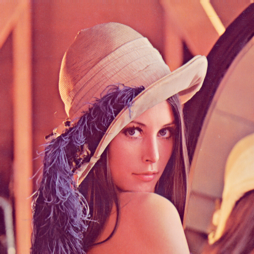

# PNG Pixel Art Filter
Pixel Art Filter is an image filter that pixelates PNG images using a lossy image compression algorithm, written in C++ using clang and LodePNG.
* lena.png [474756]  

* lena.paf100.png [256651] (`./pngpaf images/lena.png images/lena.paf100.png`)  

* lena.paf200.png [176850] (`./pngpaf images/lena.png images/lena.paf200.png 200`)  

* lena.paf500.png [105063] (`./pngpaf images/lena.png images/lena.paf500.png 500`)  


## Prerequisites
To run this project, after cloning it:
### Add LodePNG
LodePNG library is used to encode and deocde PNG images:
* Compile and install library from https://github.com/zvezdochiot/lodepng

## Deployment
To compile the project, use the command:
```
make
```
And once that is finished, run the project using:
```
./pngpaf input.png filter.png [tol=100] [pct=1.000000]
```
You can also remove the compiler output files by running the command:
```
make clean
```

2020
